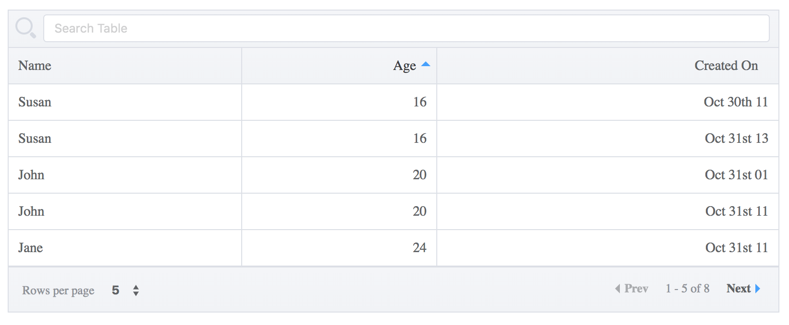
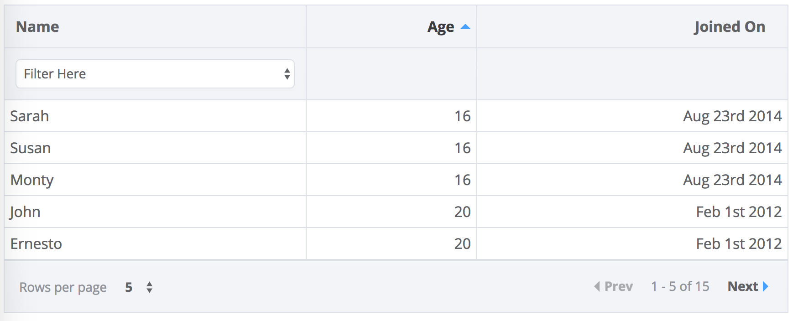
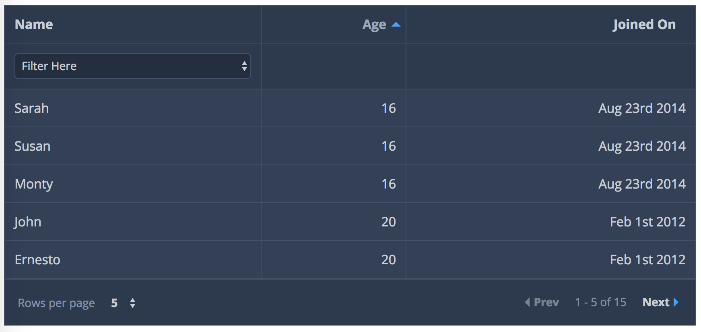

# Vue-good-table

[](https://www.npmjs.com/package/vue-good-table)
[](https://github.com/xaksis/vue-good-table/releases)
[](https://github.com/xaksis/vue-good-table/blob/master/LICENSE)

A simple, clean data table for VueJS (2.x) with essential features like sorting, column filtering, pagination etc

Hey there! coming from 1.x? find the [upgrade guide here](https://github.com/xaksis/vue-good-table/wiki/Guide-to-upgrade-from-1.x-to-v2.0)


## Live Demo

[vue-good-table Demo Site](https://xaksis.github.io/vue-good-demos/#/simple-table)

## Table of contents

<!-- START doctoc generated TOC please keep comment here to allow auto update -->
<!-- DON'T EDIT THIS SECTION, INSTEAD RE-RUN doctoc TO UPDATE -->


- [Getting Started](#getting-started)
  - [Installing](#installing)
  - [Example Usage](#example-usage)
- [Configuration](#configuration)
  - [Component Options](#component-options)
    - [Table](#table)
      - [columns](#columns)
      - [rows](#rows)
      - [rtl](#rtl)
      - [lineNumbers](#linenumbers)
      - [responsive](#responsive)
    - [Sort](#sort)
      - [sortable](#sortable)
      - [defaultSortBy<](#defaultsortby)
    - [Pagination](#pagination)
      - [paginate](#paginate)
      - [paginateOnTop](#paginateontop)
      - [perPage](#perpage)
      - [customRowsPerPageDropdown](#customrowsperpagedropdown)
    - [Search](#search)
      - [searchEnabled](#searchenabled)
      - [searchTrigger](#searchtrigger)
      - [searchFn](#searchfn)
      - [searchPlaceholder](#searchplaceholder)
      - [externalSearchQuery](#externalsearchquery)
    - [Style/Theme](#styletheme)
      - [styleClass](#styleclass)
      - [rowStyleClass](#rowstyleclass)
      - [theme](#theme)
    - [Text](#text)
      - [nextText](#nexttext)
      - [prevText<](#prevtext)
      - [rowsPerPageText](#rowsperpagetext)
      - [ofText](#oftext)
      - [allText](#alltext)
  - [Column Options](#column-options)
      - [label<](#label)
      - [field](#field)
      - [type](#type)
      - [dateInputFormat](#dateinputformat)
      - [dateOutputFormat](#dateoutputformat)
      - [sortable](#sortable-1)
      - [sortFn](#sortfn)
      - [formatFn](#formatfn)
      - [html](#html)
      - [width](#width)
      - [hidden](#hidden)
      - [thClass](#thclass)
      - [tdClass](#tdclass)
      - [globalSearchDisabled](#globalsearchdisabled)
      - [filterOptions](#filteroptions)
    - [Column filter option in-depth](#column-filter-option-in-depth)
      - [filterDropdownItems](#filterdropdownitems)
      - [filterFn](#filterfn)
  - [Style Options](#style-options)
    - [.vgt-table](#vgt-table)
    - [.vgt-table .stripped](#vgt-table-stripped)
    - [.vgt-table .condensed](#vgt-table-condensed)
- [Theme](#theme)
  - [default](#default)
  - [nocturnal `theme='nocturnal'`](#nocturnal-themenocturnal)
- [Advanced Customization](#advanced-customization)
  - [Custom row template](#custom-row-template)
  - [Custom column headers](#custom-column-headers)
  - [Empty state slot](#empty-state-slot)
- [Authors](#authors)
- [License](#license)

<!-- END doctoc generated TOC please keep comment here to allow auto update -->

## Getting Started

### Installing

Install with npm:
```bash
npm install --save vue-good-table@alpha
```

Import into project:
```javascript
import Vue from 'vue';

import VueGoodTable from 'vue-good-table';
// import the styles 
import 'vue-good-table/dist/vue-good-table.css'

Vue.use(VueGoodTable);
```

### Example Usage
```html
<template>
  <div>
    <vue-good-table
      :columns="columns"
      :rows="rows"
      :paginate="true"/>
  </div>
</template>

<script>
export default {
  name: 'my-component',
  data(){
    return {
      columns: [
        {
          label: 'Name',
          field: 'name',
          filterable: true,
        },
        {
          label: 'Age',
          field: 'age',
          type: 'number',
          html: false,
          filterable: true,
        },
        {
          label: 'Created On',
          field: 'createdAt',
          type: 'date',
          inputFormat: 'YYYYMMDD',
          outputFormat: 'MMM Do YY',
        },
        {
          label: 'Percent',
          field: 'score',
          type: 'percentage',
          html: false,
        },
      ],
      rows: [
        {id:1, name:"John",age:20,createdAt: '201-10-31:9:35 am',score: 0.03343},
        {id:2, name:"Jane",age:24,createdAt: '2011-10-31',score: 0.03343},
        {id:3, name:"Susan",age:16,createdAt: '2011-10-30',score: 0.03343},
        {id:4, name:"Chris",age:55,createdAt: '2011-10-11',score: 0.03343},
        {id:5, name:"Dan",age:40,createdAt: '2011-10-21',score: 0.03343},
        {id:6, name:"John",age:20,createdAt: '2011-10-31',score: 0.03343},
        {id:7, name:"Jane",age:24,createdAt: '20111031'},
        {id:8, name:"Susan",age:16,createdAt: '2013-10-31',score: 0.03343},
        {id:9, name:"Chris",age:55,createdAt: '2012-10-31',score: 0.03343},
        {id:10, name:"Dan",age:40,createdAt: '2011-10-31',score: 0.03343},
        {id:11, name:"John",age:20,createdAt: '2011-10-31',score: 0.03343},
        {id:12, name:"Jane",age:24,createdAt: '2011-07-31',score: 0.03343},
        {id:13, name:"Susan",age:16,createdAt: '2017-02-28',score: 0.03343},
        {id:14, name:"Chris",age:55,createdAt: '',score: 0.03343},
        {id:15, name:"Dan",age:40,createdAt: '2011-10-31',score: 0.03343},
        {id:19, name:"Chris",age:55,createdAt: '2011-10-31',score: 0.03343},
        {id:20, name:"Dan",age:40,createdAt: '2011-10-31',score: 0.03343},
      ],
    };
  },
};
</script>
```
This should result in the screenshot seen above

## Configuration
### Component Options
#### Table

##### columns
`Array of column objects`

Array containing objects that describe table columns

```javascript
[
    {
      label: 'Name',
      field: 'name',
      filterable: true,
    }
    //...
]
```

##### rows
`Array of row objects`

Array containing row objects

```javascript
[
    {
      id:1,
      name:"John",
      age:20
    },
    //...
]
```

##### rtl
`Boolean (default: false)`

Enable Right-To-Left layout for the table


##### lineNumbers
`Boolean (default: false)`

Show line number for each row


##### responsive
`Boolean (default: true)`

<p>Add responsive class to wrapper</p>

#### Sort

##### sortable
`Boolean (default: true)`

<p>Enable sorting table by clicking on column</p>

##### defaultSortBy
`Object`

<p>Allows specifying a default sort for the table on wakeup</p>

```javascript
{
  field: 'name',
  type: 'asc' //asc or desc (default: 'asc')
}
```

#### Pagination

##### paginate
`Boolean`

<p>Enable Pagination for table</p>

##### paginateOnTop
`Boolean`

<p>Add pagination on top of the table (default position is bottom)</p>


##### perPage
`Integer (default: 10)`

<p>Number of rows per page</p>

##### customRowsPerPageDropdown
Array (default: [10,20,30,40,50])
<p>Customize the dropdown options for the amount of items per page</p>

#### Search

##### searchEnabled
`Boolean (default: false)`

<p>Allows a single search input for the whole table *Note: enabling this filter disables column filters*</p>

##### searchTrigger
`String (default: '')`

<p>Allows user to specify if they want search to trigger on enter event of the input. By default search happens on the fly</p>

```javascript
searchTrigger='enter'
```

##### searchFn
`Function`

<p>Allows you to specify your own search function for the global search</p>

```html
<vue-good-table
  :columns="columns"
  :rows="rows"
  :searchEnabled="true"
  :globalSearchFn="searchFn" />;
```
```javascript
// in js
methods: {
  searchFn(row, col, cellValue, searchTerm){
    return value === 'my value';
  },
}
```

##### searchPlaceholder
`String (default: 'Search Table')`
<p>Text for global search input place holder</p>

##### externalSearchQuery
String

<p>Allows global search via your own input field</p>


```html
<input type="text" v-model="searchTerm" >
<vue-good-table
  :columns="columns"
  :paginate="true"
  :externalSearchQuery="searchTerm"
  :rows="rows">
 ```
 ```javascript
// and in data
data(){
    return {
      searchTerm: '',
      // rows, columns etc...
    };
}
``` 
</div>
</div>

#### Style/Theme

##### styleClass
`String (default:  'vgt-table bordered')`
<p>Allows applying your own classes to table</p>
<p>other in-built classes: condensed, striped, bordered</p>

##### rowStyleClass
`String or Function`

<p>Allows providing custom styles for rows</p>

it can be a string: 'my-class' or: 

```javascript
myStyleFn(row){ 
  // if row has something return a specific class 
  if(row.fancy) {
    return 'fancy-class';
  }
  return '';
}
```      

##### theme
`String`

* Allows using other themes</p>
* in-built theme: 'nocturnal'</p>

#### Text

##### nextText
`String (default: 'Next')`

<p>Text for pagination 'Next' link</p>

##### prevText
`String (default: 'Prev')`

<p>Text for pagination 'Prev' link</p>

##### rowsPerPageText
`String (default: 'Rows per page')`

<p>Text for pagination 'Rows per page' label</p>


##### ofText
`String (default: 'of')`

<p>Text for pagination 'x of y' label</p>

##### allText
`String (default: 'All')`

<p>Text for the last option in the items per page dropdown</p>


### Column Options
Each column objects can contain the following configuration options:


##### label
`String`

<p>Text to put on column header</p>

it can be a string: 'my-class' or: 

```javascript
{ 
  label: 'name'
}
```

##### field
`String`

<p>Row object property that this column corresponds to</p>
Can be:

* String <code>eg: 'name'</code> - simple row property name
* String <code>eg: 'location.lat'</code>- nested row property name. lets say if the row had a property 'location' which was an object containing 'lat' and 'lon'
* Function - a function that returns a value to be displayed based on the row object

```javascript
{
  field: fieldFn
}
// in methods
fieldFn(rowObj) {
  // do something with the row object
}
```

##### type
`String`

<p>type of column. default: 'text'. This determines the formatting for the column and filter behavior as well</p>
Possible values:
<ul>
  <li>number - right aligned</li>
  <li>decimal - right aligned, 2 decimal places</li>
  <li>percentage - expects a decimal like 0.03 and formats it as 3.00%</li>
  <li>date - expects a string representation of date eg <code>'20170530'</code>. You should also specify dateInputFormat and dateOutputForamt</li>
</ul>

##### dateInputFormat
`String`
provide the format to parse date string

String eg: <code>'YYYYMMDD' //where date strings are '20170530'</code>

##### dateOutputFormat
`String`

<p>provide the format for output date</p>
String eg: <code>'MMM Do YY' //where date will be output like 'May 30th 17'</code>

##### sortable
`Boolean`

<p>enable/disable sorting on columns. This property is higher priority than global sortable property</p>

##### sortFn
`Function`

<p>custom sort function. If you want to supply your own sort function you can use this property to supply it.</p>

```javascript
// in data
column: [
  {
    label: 'Name',
    field: 'name',
    sortable: true,
    sortFn: this.sortFn,
  }
  //...
],
// in methods
methods: {
  sortFn(x, y, col) {
    return (x < y ? -1 : (x > y ? 1 : 0));
  }
}
```

##### formatFn
`Function`

<p>Allows for custom format of values, <code>function(value)</code>, should return the formatted value to display.</p>

```javascript
formatFn: function(value) {
  return '$' + value;
}
```

##### html
`Boolean`

<p>indicates whether this column will require html rendering or not</p>

example: if row had a property 'htmlContent' like <code>htmlContent: '&lt;button&gt;Hello&lt;/button&gt;'</code>, then `html: true` on the column will render a button

##### width
`Number`

<p>provide a width value for this column</p>

<code>width: '50px'</code>

##### hidden
`Boolean`

<p>allow hiding a column on table</p>

##### thClass
`String`

<p>provide custom class(es) to the th</p>

example: <code>thClass: 'custom-th-class'</code>

##### tdClass
`String`

<p>provide custom class(es) to the td</p>

example: <code>tdClass: 'text-center'</code>

##### globalSearchDisabled
`Boolean (default: false)`

<p>if true, this column will be ignored by the global search</p>

##### filterOptions
`Object`

<p>A collection of filter specific properties</p>

```javascript
{
  enabled: true, // enable filter for this column
	placeholder: 'Filter This Thing', // placeholder for filter input
	filterValue: 'Jane', // initial populated value for this filter
	filterDropdownItems: [], // dropdown (with selected values) instead of text input
	filterFn: this.columnFilterFn, //custom filter function that 
}
```

#### Column filter option in-depth
Some filterOption properties need a little more explanation

##### filterDropdownItems
`Array of strings or array of objects`

<p>allows creating a dropdown for filter as opposed to an input</p>

```javascript
//array
filterOptions: ['Blue', 'Red', 'Yellow']
//or
filterOptions: [  
  { value: 'n', text: 'Inactive' },  
  { value: 'y', text: 'Active' },  
  { value: 'c', text: 'Check' }  
],
```

##### filterFn

`Function`

<p>Custom filter, function of two variables: <code>function(data, filterString)</code>, should return true if data matches the filterString, otherwise false.</p>

```javascript
filterFn: function(data, filterString) {
  var x = parseInt(filterString)
  return data >= x-5 && data <= x+5
}
//would create a filter matching numbers within 5 of the provided value.
```

### Style Options

Vue-good-table allows providing your own css classes for the table via **styleClass** option but it also has in-built classes that you can make use of

#### .vgt-table


#### .vgt-table .stripped


#### .vgt-table .condensed



## Theme
Vue-good-table currently comes in two themes
### default
### nocturnal `theme='nocturnal'`


## Advanced Customization

### Custom row template
vue-good-table also supports dynamic td templates where you dictate how to display the cells. Example:
```html
<vue-good-table
  :columns="columns"
  :rows="rows">
  <template slot="table-row" slot-scope="props">
    <span v-if="props.column.field == 'age'">
      age: {{props.row.age}}
    </span>
    <span v-else>
      {{props.formattedRow[props.column.field]}}
    </span>
  </template>
</vue-good-table>
```
**Note:** 
* The original row object can be accessed via `props.row`
* The currently displayed table row index can be accessed via `props.index` . 
* The original row index can be accessed via `props.row.originalIndex`. You can then access the original row object by using `row[props.row.originalIndex]`.
* The column object can be accessed via `props.column`
* You can access the formatted row data (for example - formatted date) via `props.formattedRow`

### Custom column headers
Sometimes you might want to use custom column formatting. You can do that in the following way
```html
<vue-good-table
  :columns="columns"
  :rows="rows">
  <template slot="table-column" slot-scope="props">
     <span v-if="props.column.label =='Name'">
        <i class="fa fa-address-book"></i> {{props.column.label}}
     </span>
     <span v-else>
        {{props.column.label}}
     </span>
  </template>
</vue-good-table>
```

### Empty state slot
You can provide html for empty state slot as well. Example:

```html
<vue-good-table
  :columns="columns"
  :rows="rows">
  <div slot="emptystate">
    This will show up when there are no columns
  </div>
</vue-good-table>
```

## Authors

* [xaksis](https://github.com/xaksis)
* [Other Contributors](https://github.com/xaksis/vue-good-table/graphs/contributors)

## License

This project is licensed under the MIT License - see the [LICENSE.md](LICENSE) file for details
